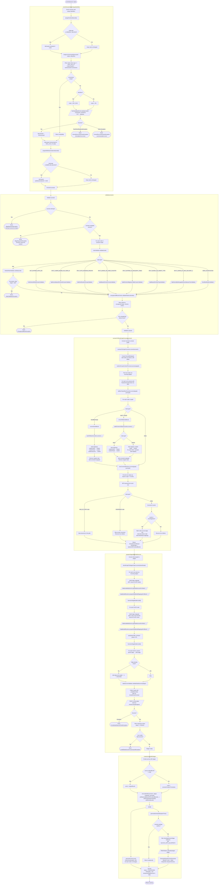

# Scenario-to-Journey Conversion Flow

## `ScenarioToJourneyConverter::convert`

```mermaid
flowchart TD
    START(["convert(source: Input)"]) --> ENRICH

    %% ── Step 1: Enrich Scenario ──────────────────────────────
    subgraph ENRICH_SUB ["enrichScenarioWithUniqueIdentifiers"]
        ENRICH[Enrich scenario with unique identifiers]

        ENRICH --> SENDOUT_IDS["assignSendoutIds(nodes)"]
        SENDOUT_IDS --> SENDOUT_CHECK{node.type<br/>in SENDOUT_BLOCKS?}
        SENDOUT_CHECK -->|Yes| ADD_SENDOUT["Add param sendoutId = UUID"]
        SENDOUT_CHECK -->|No| SKIP_SENDOUT[Keep node unchanged]
        ADD_SENDOUT --> LIVE_IDS
        SKIP_SENDOUT --> LIVE_IDS

        LIVE_IDS["assignLiveJourneyIds(journeyId, nodes, isDryRun)"]
        LIVE_IDS --> FILTER_LIVE["Filter nodes where type == RUN_LIVE_V2<br/>Collect blockId → liveScenarioId connections"]
        FILTER_LIVE --> LIVE_EMPTY{connections<br/>empty?}
        LIVE_EMPTY -->|Yes| LIVE_SKIP["Return emptyMap"]
        LIVE_EMPTY -->|No| LIVE_MODE{"isDryRun?"}
        LIVE_MODE -->|Yes| LIVE_DRY["mode = DRY_RUN"]
        LIVE_MODE -->|No| LIVE_ON["mode = ON"]
        LIVE_DRY --> LIVE_CALL
        LIVE_ON --> LIVE_CALL
        LIVE_CALL[/"liveCampaignService.start(journeyId, connections, isDryRun)<br/>PUT …/{id}/start"/]
        LIVE_CALL --> LIVE_OK{Success?}
        LIVE_OK -->|Yes| LIVE_MAP["Map blockId → liveJourneyId"]
        LIVE_OK -->|RestClientResponseException| LIVE_ERR1(["throw CannotRunLiveScenarioException<br/>(formatted live errors)"])
        LIVE_OK -->|Other Exception| LIVE_ERR2(["throw CannotRunLiveScenarioException<br/>(communication error)"])
        LIVE_MAP --> ADD_LIVE["Add param liveJourneyId to RUN_LIVE_V2 nodes"]
        LIVE_SKIP --> ADD_LIVE

        ADD_LIVE --> WEBFLOW_IDS["assignWebflowActivationIds(nodes)"]
        WEBFLOW_IDS --> WEBFLOW_CHECK{node.type<br/>in WEBFLOW_BLOCKS?}
        WEBFLOW_CHECK -->|Yes| ADD_WEBFLOW["Add param webflowActivationId = UUID"]
        WEBFLOW_CHECK -->|No| SKIP_WEBFLOW[Keep node unchanged]
        ADD_WEBFLOW --> ENRICH_DONE[Enriched scenario]
        SKIP_WEBFLOW --> ENRICH_DONE
    end

    ENRICH_DONE --> VALIDATE

    %% ── Step 2: Validate Scenario ────────────────────────────
    subgraph VALIDATE_SUB ["validate(scenario)"]
        VALIDATE[Validate scenario]
        VALIDATE --> CHK_EMPTY{scenario.isEmpty?}
        CHK_EMPTY -->|Yes| ERR_EMPTY(["throw IllegalArgumentException<br/>'Scenario cannot be empty'"])
        CHK_EMPTY -->|No| CHK_ACTIVE{scenario.metadata<br/>.isActive?}
        CHK_ACTIVE -->|No| ERR_INACTIVE(["throw IllegalArgumentException<br/>'Scenario cannot be inactive'"])
        CHK_ACTIVE -->|Yes| NODE_LOOP["For each node in scenario.nodes"]

        NODE_LOOP --> NODE_VAL["nodeValidator.validate(node)"]
        NODE_VAL --> NODE_TYPE{"node.type?"}
        NODE_TYPE -->|"GET_ENTRIES_WITH_IDS"| V1[/"GetEntriesWithIdsCustomValidator"/]
        NODE_TYPE -->|"SPLIT_USERS_BASED_ON_USER_ID"| V2[/"SplitUsersBasedOnUserIdCustomValidator"/]
        NODE_TYPE -->|"SPLIT_INTO_RANDOM_GROUPS"| V3[/"SplitIntoRandomGroupsValidator"/]
        NODE_TYPE -->|"SPLIT_BASED_ON_USER_COUNTRY"| V4[/"SplitBasedOnUserCountryValidator"/]
        NODE_TYPE -->|"SPLIT_ENTRIES_IN_BIGQUERY_TABLE"| V5[/"SplitEntriesInBigQueryTableCustomValidator"/]
        NODE_TYPE -->|"SPLIT_BASED_ON_SMART_TYPE"| V6[/"SplitBasedOnSmartTypeValidator"/]
        NODE_TYPE -->|"SPLIT_USERS_BY_MSG_DELIVERY_2"| V7[/"SplitUsersByMessageDeliveryStatusesTwoValidator"/]
        NODE_TYPE -->|"SEND_NOTIFICATION"| V8[/"SendNotificationValidator"/]
        NODE_TYPE -->|else| V_DEF["DefaultNodeValidator.validate(node)"]
        V_DEF --> PARAM_LEN{Any param value<br/>length > 500?}
        PARAM_LEN -->|Yes| ERR_LEN(["throw NodeValidationException"])
        PARAM_LEN -->|No| UNSUP_CHK

        V1 --> UNSUP_CHK
        V2 --> UNSUP_CHK
        V3 --> UNSUP_CHK
        V4 --> UNSUP_CHK
        V5 --> UNSUP_CHK
        V6 --> UNSUP_CHK
        V7 --> UNSUP_CHK
        V8 --> UNSUP_CHK

        UNSUP_CHK["unsupportedBlocksCheck.validateNodesList(nodes)"]
        UNSUP_CHK --> UNSUP_FILTER["Filter nodes by unsupported (type, version) entries"]
        UNSUP_FILTER --> UNSUP_ANY{Any unsupported<br/>blocks found?}
        UNSUP_ANY -->|Yes| ERR_UNSUP(["throw UnsupportedBlockException"])
        UNSUP_ANY -->|No| VALIDATE_DONE[Validation passed]
    end

    VALIDATE_DONE --> SLICE_CONVERT

    %% ── Step 3: Convert to Sliced Graph ──────────────────────
    subgraph SLICE_SUB ["scenarioToSlicedGraphConverter.convert"]
        SLICE_CONVERT["Convert scenario to sliced graph"]

        SLICE_CONVERT --> TO_GRAPH["scenarioToGraphConverter.convert(scenario)"]
        TO_GRAPH --> GRAPH_BUILD["Create DirectedMultigraph<br/>Add nodes as vertices, add edges"]

        GRAPH_BUILD --> RAND_GROUPS["randomGroupsContextProcessor.process(graph)"]
        RAND_GROUPS --> RAND_ROOTS["Find root nodes (no incoming edges)"]
        RAND_ROOTS --> RAND_PROC["For each root: process with<br/>RandomGroupsContext via DFS"]

        RAND_PROC --> BY_TYPE["byBlockTypeSliceConverter.convert(graph, journeyId)"]
        BY_TYPE --> TYPE_LOOP["For each node in graph"]
        TYPE_LOOP --> TYPE_CHECK{node.type?}

        TYPE_CHECK -->|SendBlockType| SEND_CONV["convertSendBlocks"]
        SEND_CONV --> SEND_SLICE[/"sendToSliceConverter.convert(…)"/]
        SEND_SLICE --> SEND_MAP["Add mappings:<br/>nodeId-Write → nodeId<br/>nodeId-Read → nodeId<br/>nodeId-bouncer → nodeId"]
        SEND_MAP --> SEND_SWAP["Remove original node<br/>Add converted subgraph"]
        SEND_SWAP --> SIZE_ENF

        TYPE_CHECK -->|"WAIT / UNION"| WAIT_CONV["convertWaitLikeBlocks"]
        WAIT_CONV --> WAIT_SLICE[/"waitOrUnionToSliceConverter.convert(…)"/]
        WAIT_SLICE --> WAIT_TYPE{node.type?}
        WAIT_TYPE -->|WAIT| WAIT_MAP["Add mappings:<br/>nodeId-Write → nodeId<br/>nodeId-Read → nodeId"]
        WAIT_TYPE -->|UNION| UNION_MAP["Add mapping: nodeId-Read → nodeId<br/>For each Write- subnode: add mapping"]
        WAIT_MAP --> WAIT_SWAP["Add converted subgraph<br/>Remove original node"]
        UNION_MAP --> WAIT_SWAP
        WAIT_SWAP --> SIZE_ENF

        TYPE_CHECK -->|Other| SIZE_ENF

        SIZE_ENF["sizeConstraintEnforcer.convert(graph, journeyId)"]
        SIZE_ENF --> SIZE_ROOTS["Find all root nodes (no inputs or type == SLICE)"]
        SIZE_ROOTS --> SIZE_TRAVERSE["BFS traversal from each root"]
        SIZE_TRAVERSE --> SIZE_NODE{node.type?}
        SIZE_NODE -->|END_OF_PATH node| SIZE_STOP["Stop traversal on this path"]
        SIZE_NODE -->|IGNORABLE node| SIZE_SKIP["Skip counter increment<br/>Recurse into children"]
        SIZE_NODE -->|Other| SIZE_INC["Increment counter"]
        SIZE_INC --> SIZE_OVER{counter ><br/>maxStageSize?}
        SIZE_OVER -->|Yes| SIZE_NEW["Mark node as new stage root<br/>Add slice before node<br/>Add Write/Read mappings"]
        SIZE_OVER -->|No| SIZE_CHILDREN["Recurse into children"]
        SIZE_STOP --> SLICE_RESULT
        SIZE_SKIP --> SLICE_RESULT
        SIZE_NEW --> SLICE_RESULT
        SIZE_CHILDREN --> SLICE_RESULT

        SLICE_RESULT["Return SlicingScenarioResult<br/>(resultGraph + backendToFrontendBlocks)"]
    end

    SLICE_RESULT --> STAGES_CONVERT

    %% ── Step 4: Prepare Stages with Data Sources ─────────────
    subgraph STAGES_SUB ["prepareStagesWithDataSources"]
        STAGES_CONVERT["Convert sliced graph to stages"]

        STAGES_CONVERT --> STAGES_GRAPH["slicedGraphToStagesGraph.convert(slicedGraph)"]

        STAGES_GRAPH --> ROOT_STAGES["For each root node (no incoming edges)"]
        ROOT_STAGES --> ROOT_BUILD["Build stage subgraph<br/>(DFS, stop at SLICE nodes)"]
        ROOT_BUILD --> ROOT_DS[/"dataAvailabilityService.getDataSourcesForNode(…)"/]
        ROOT_DS --> ROOT_DM[/"dataModelResolver.prepareDataModelMappingsForBlock(…)"/]
        ROOT_DM --> ROOT_STAGE["ScenarioStageBuilder.build()"]

        ROOT_STAGE --> SLICE_STAGES["For each SLICE node"]
        SLICE_STAGES --> SLICE_BUILD["Build stage subgraph<br/>(DFS, stop at next SLICE)<br/>Remove SLICE vertex"]
        SLICE_BUILD --> SLICE_DS[/"dataAvailabilityService.getDataSourcesForNode(…)"/]
        SLICE_DS --> SLICE_DM_2[/"dataModelResolver.prepareDataModelMappingsForBlock(…)"/]
        SLICE_DM_2 --> SLICE_OFFSET["withOffset(TIME_OFFSET param or 0)"]
        SLICE_OFFSET --> SLICE_STAGE["ScenarioStageBuilder.build()"]

        SLICE_STAGE --> EDGES_LOOP["For each SLICE: connect parent stage → child stage"]
        EDGES_LOOP --> EDGE_EXISTS{Edge already<br/>exists?}
        EDGE_EXISTS -->|No| ADD_EDGE["Add edge with weight = −1 × child.offset"]
        EDGE_EXISTS -->|Yes| SKIP_EDGE["Skip"]
        ADD_EDGE --> DS_VALIDATE
        SKIP_EDGE --> DS_VALIDATE

        DS_VALIDATE["dataSourcesValidator.validateDataSources(stages)"]
        DS_VALIDATE --> DS_REQUEST["Collect nodes with predefined data<br/>Filter by shouldCheckContract"]
        DS_REQUEST --> DS_CALL[/"POST to coma-data-observer<br/>checkContractEndpoint"/]
        DS_CALL --> DS_OK{Success?}
        DS_OK -->|Exception| ERR_COMA(["throw ComaDataObserverClientException"])
        DS_OK -->|Yes| DS_FILTER["Filter responses where status == INVALID"]
        DS_FILTER --> DS_INVALID{Any invalid<br/>data sources?}
        DS_INVALID -->|Yes| ERR_DS(["throw InvalidDataSourceForJourneyInitException"])
        DS_INVALID -->|No| STAGES_DONE["Stages ready"]
    end

    STAGES_DONE --> CREATE_JOURNEY

    %% ── Step 5: Create Journey ───────────────────────────────
    subgraph JOURNEY_SUB ["createJourneyWithStages"]
        CREATE_JOURNEY["Create journey with stages"]

        CREATE_JOURNEY --> RESOLVE_RUNAT{"source.originalRunAt<br/>!= null?"}
        RESOLVE_RUNAT -->|Yes| USE_ORIG["runAt = originalRunAt"]
        RESOLVE_RUNAT -->|No| USE_CREATED["runAt = scenarioCreationTimestamp"]
        USE_ORIG --> BUILDER
        USE_CREATED --> BUILDER

        BUILDER["JourneyBuilder(scenario, stages, createdAt, journeyId)<br/>.withBackendBlockIdToFrontendBlockId(…)<br/>.withScheduled(scheduled)<br/>.withRunAt(runAt)"]
        BUILDER --> BUILD[".build()"]

        BUILD --> GEN_USERS["generateUsersCount()<br/>UsersCount(nodeId, null) for each node in all stages"]
        BUILD --> GEN_DISPATCH["generateEstimatedDispatchTime()"]
        GEN_DISPATCH --> DRYRUN_CHK{scenario.settings<br/>.dryRun?}
        DRYRUN_CHK -->|Yes| EMPTY_DISPATCH["Return emptyList()"]
        DRYRUN_CHK -->|No| FIND_SEND["Filter SendingScenarioStage instances<br/>with BLOCKS_WITH_BLUEPRINTS"]
        FIND_SEND --> CALC_OFFSET[/"OffsetHelpers.calculate(stages, stage)"/]
        CALC_OFFSET --> DISPATCH_PARAM["EstimatedDispatchTimeParameter<br/>(blockId, runAt + offset,<br/>blueprintId, blueprintVersion)"]

        GEN_USERS --> JOURNEY_OBJ
        EMPTY_DISPATCH --> JOURNEY_OBJ
        DISPATCH_PARAM --> JOURNEY_OBJ

        JOURNEY_OBJ["Journey<br/>status = PROCESSING<br/>finishedAt = null<br/>temporaryDataRemoved = false"]
    end

    JOURNEY_OBJ --> RETURN(["Return Journey"])
```
